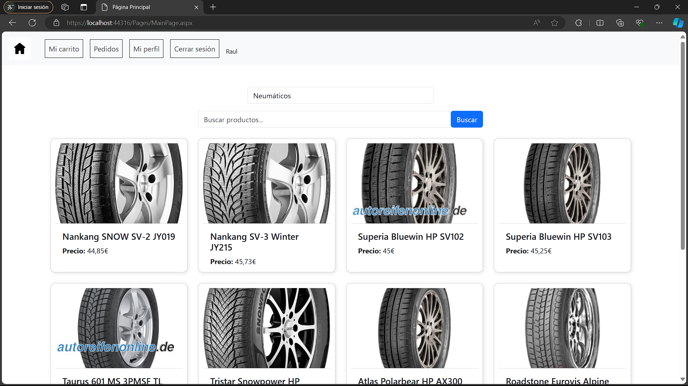
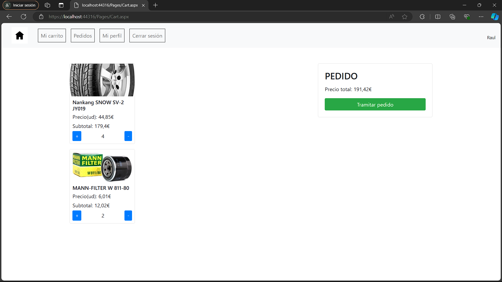
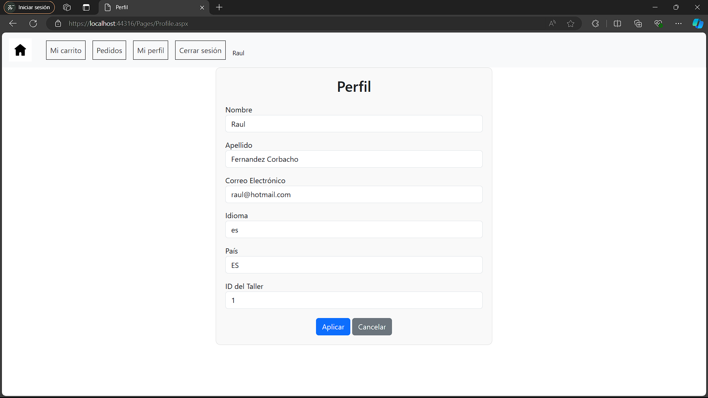
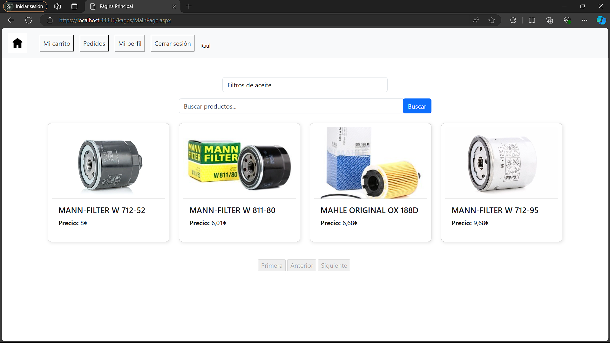

# AutoShop

This repository contains the source code for a vehicle parts store application built using ASP.NET.

## Table of Contents

- [Introduction](#introduction)
- [Features](#features)
- [Technologies Used](#technologies-used)

## Introduction

AutoShop is a web application where users can browse, search and purchase various vehicle parts.
This project was developed by me and Daniel Ferreiro Villamor for the university course "Marcos de desarrollo".

## Features

- **User Registration and Authentication**
- **Product Catalog**: You can search by name and filter by product categories.
- **Shopping Cart**: Add parts to the shopping cart and proceed to checkout.
- **Order Management**: Users can view their order history.

## Technologies Used

- **ASP.NET**:
- **Entity Framework**: For database operations.
- **SQL Server**: Database management system.
- **Bootstrap**: For responsive design and UI components.
- **jQuery**: To enhance the user experience with interactive elements.

# Preview

  
  
  
  

## Contributors

- [Juan Villaverde Rodriguez](https://github.com/JuanVillaverdeRodriguez)
- [Daniel Ferreiro Villamor](https://github.com/dferreirovillamor)
